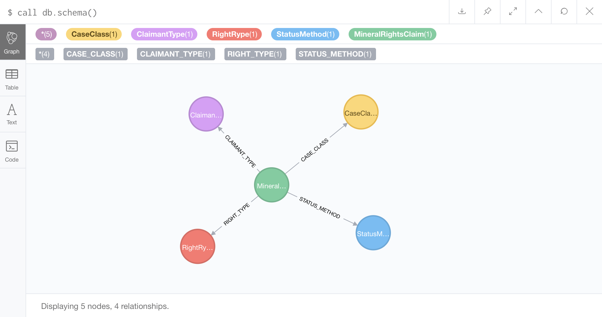

# Menome Harvest Demo

This demo illustrates the Menome Data Atomization pattern. It includes an example of the CSV harvester bot which takes a model and a CSV file, and atomizes the CSV file into a neo4j graph.

For details regarding the Menome Data Atomization pattern, please refer to the youtube video and associated presentation: 
* [Menome Data Atomization Harvester Pattern](http://www.menome.com/var/www/html/files/171202-5_menome_data_atomization.pdf)
* [Menome Presentation on Data Atomization to Neo4j Developer Communtiy](https://www.youtube.com/watch?v=sZhQMeP6Al4)

## Running the Demo:

In order to run the demo:
* Clone the repository
* Open a terminal window and go into the HarvestDemo sub-dir
* docker-compose up to start the Menome Knowledge Infastructure
* Query the harvest endpoint to find out the CSV Bot Capabities using Postman or equivalent: [http://localhost:3021](http://localhost:3021)
* Trigger the CSV Harvest process by Posting to the CSV Harvester endpoint using Postman or eqivalent. Using the defaults will trigger the base example model. Other files/models can be harvested by setting paratmers on post. 


You can see the messages flowing through the from the CSV Harvester into the RabbitMQ instance using the RabbitMQ Manager located at : [http://localhost:15672/#/](http://localhost:15672/#/ ). Refinery messages will appear in the terminal window. 

You can inspect the neo4j graph as the Menome Data Refinery builds the model from messages by using the Neo4j Browser: [http://localhost:7474](http://localhost:7474). The database will initially be blank, and then gradually build out to fully represente the CSV data file as per the model definition as messages are recieved and processed. 

Schema:


Graph Pattern:


## CSV Harvesting Pattern Details

There are several key components to the CSV harvesting pattern:

- CSV File - while the csvHarvester can handle any number of CSV files, this demo will illustrate the pattern using a single file. The CSV file must be in standard CSV format, and have the column names in the first row of data. The csvHarvester can access files stored anywhere using the Menome Librarian, but for this demo, the file must be placed into the **./local** folder provided. 
- Model File - the Menome BotFramework uses simple Javascript based model files using the Menome Data Atomization mapping pattern to translate source data into a simple JSON based messaging structure. The Model file provided shows the key elements of the mapping structure. 
- RabbitMQ - while the Menome BotFramework can use other messaging systems such as Kafka, for the purposes of CSV files we have found that RabbitMQ is the easiest to work with, most lightweight, and simplest of these to setup. Menome uses a standard RabbitMQ container, which the BotFramework initializes automatically using an internal configuraiton process. 
- DataRefinery - The Menome Data Refinery is at the heart of the Menome Data Atomization pattern. The DataRefinery connects to the RabbitMQ instance and waits for Menome Data Atoms to arrive on the Refinery Queue. The refinery uses these messages to generate Nodes and Relationships automatically the Neo4j instance. 

## The Data Atomization Message Mapping Pattern

The Menome BotFramework can harvest data from virutally any source including REST, Soap, SQL, noSQL. The harvesting functions vary a bit depending on the source, but the model structure for each of these sources remains consistent. 

The BotFramework transform function is a simple mapping pattern that delivers an ITEM from the source. The ITEM contains all of the key value pairs available from the source as a regular javascript object. 

The model is composed of two primary element: Node and Connections to the Node. 

### Data Subject/Entity 

The Data Subject corresponds to the Node in the graph database. 

* Name - the Name property to be assigned to the Node
* NodeType - the Label to assign to the Node
* SourceSystem - this property allows the Menome framework to track which system this Node was contributed from. This can be set using paramters.
* Priority - Sets the overll priority associated with the system. This is used by the Menome DataRefinery to determine which SourceSystems take precendence when mapping the same property from several systems to the same node. 
* ConformedDimension - this is the key used to idenfity a unique instance of a Node. One or many ConformedDimensions can be set to inform the Refinery of how to merge data from source systems. 
* Properties - this is a list of properties to set on the Node


```
{
      "Name": itm.name,
      "NodeType":"Person",
      "SourceSystem": "CSVHarvester",
      "Priority": 1,
      "ConformedDimensions": {
        "Code": itm.code
      },
      "Properties": {

      },
```

### Connections 

Connections are first degree relationships to the specific Node. 

* NodeType: Type of node being connected to
* RelType: Relationship Name 


```
{
      "Name": itm.name,
      "NodeType":"Person",
      "SourceSystem": "CSVHarvester",
      "Priority": 1,
      "ConformedDimensions": {
        "Code": itm.code
      },
      "Properties": {

      },
      "Connections":[
        {
          "NodeType": "Skill",
          "RelType": "IN_SECTION",
          "ForwardRel": true,
          "ConformedDimensions": {
            "sectionId": itm.skill
          },
          "Properties": {

          },
          "RelProps": {
              
          }          
        }
      ]
    }
```

### transform functions

The bot framework also has a set of built-in transform functions although 

### Data Atom Message: 

##############
Model transform functions should return a JSON object with the following structure. 
{
      "Name": itm.name,
      "NodeType":"Person",
      "SourceSystem": "CSVHarvester",
      "Priority": 1,
      "ConformedDimensions": {
        "Code": itm.code
      },
      "Properties": {

      },
      "Connections":[
        {
          "NodeType": "Skill",
          "RelType": "IN_SECTION",
          "ForwardRel": true,
          "ConformedDimensions": {
            "sectionId": itm.skill
          },
          "Properties": {

          },
          "RelProps": {
              
          }          
        }
      ]
    }


## NOTE 

For this to work currently with the message-server container, the default messageserver_exchange must be manually removed and re-created in the rabbitmq admin console. 

This is because there is an error in the message-server where it is not setting the correct routing key in the binding. 

The *messageserver* Routing Key must be manually added by unbinding the devault messageserver_exchange binding, and then creating a new messageserver_exchange binding with a *messageserver* routing key:

